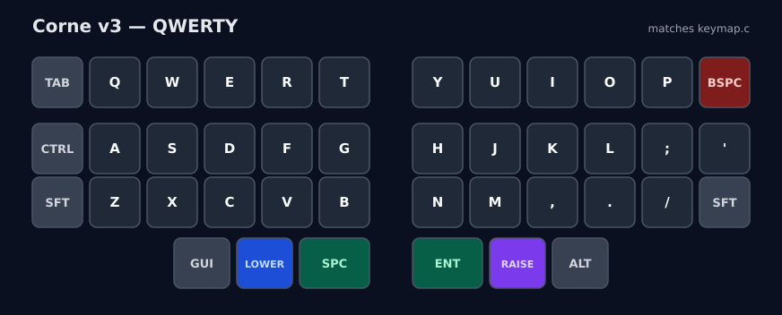
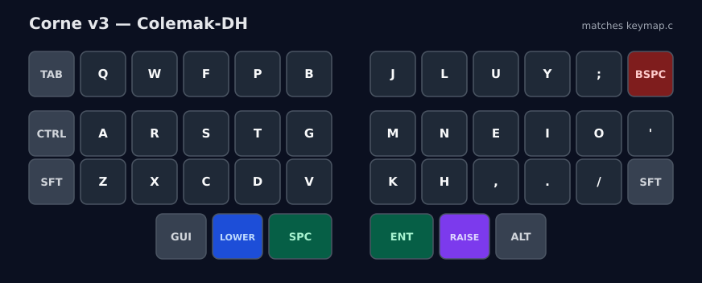

# Keyboard firmware guide

Visual flash and layout guide. Keep the **OS layout on US QWERTY** so the firmware is the only remapper.

Full diagrams: [docs/images/](docs/images/)

## Boards

| Board | Keys | QMK target | Folder |
| --- | --- | --- | --- |
| Lily58 | 58 (6×4 + 4 thumbs) | `lily58/rev1` | [lily58/](lily58/) |
| Corne v3 (crkbd) | 42 (3×6 + 3 thumbs) | `crkbd/rev1` | [corne/](corne/) |

Corne **v4** is `crkbd/rev4`.

## Lily58 QWERTY


```
ESC   1  2  3  4  5                    6  7  8  9  0  `
TAB   Q  W  E  R  T                    Y  U  I  O  P  -
CTRL  A  S  D  F  G                    H  J  K  L  ;  '
SFT   Z  X  C  V  B   [          ]     N  M  ,  .  /  SFT
            ALT  GUI  LOWER  SPC    ENT  RAISE  BSPC  GUI
```

- **Lower** F-keys + symbols
- **Raise** arrows / Home End PgUp PgDn / media
- **Adjust** (Lower+Raise) bootloader

```bash
qmk flash -kb lily58/rev1 -km qwerty
qmk flash -kb lily58/rev1 -km qwerty -e CONVERT_TO=promicro_rp2040
```

## Lily58 Colemak-DH


```
ESC   1  2  3  4  5                    6  7  8  9  0  `
TAB   Q  W  F  P  B                    J  L  U  Y  ;  -
CTRL  A  R  S  T  G                    M  N  E  I  O  '
SFT   Z  X  C  D  V   [          ]     K  H  ,  .  /  SFT
            ALT  GUI  LOWER  SPC    ENT  RAISE  BSPC  GUI
```

## Corne v3 QWERTY



```
TAB   Q  W  E  R  T          Y  U  I  O  P  BSPC
CTRL  A  S  D  F  G          H  J  K  L  ;  '
SFT   Z  X  C  V  B          N  M  ,  .  /  SFT
           GUI  LOWER  SPC    ENT  RAISE  ALT
```

```bash
qmk flash -kb crkbd/rev1 -km tuanpep
qmk flash -kb crkbd/rev1 -km tuanpep -e CONVERT_TO=promicro_rp2040
```

## Corne v3 Colemak-DH



```
TAB   Q  W  F  P  B          J  L  U  Y  ;  BSPC
CTRL  A  R  S  T  G          M  N  E  I  O  '
SFT   Z  X  C  D  V          K  H  ,  .  /  SFT
           GUI  LOWER  SPC    ENT  RAISE  ALT
```

Hold Lower+Raise, tap left **A** = QWERTY, tap left **Z** = Colemak-DH.

## Flash rules

1. Unplug the TRRS cable.
2. Plug in one half over USB.
3. Reset into bootloader.
4. Flash, then repeat for the other half.
5. Reconnect TRRS. USB goes in the **left** half.

Do not flash with the halves linked. Do not use a 3-pole TRS cable.
